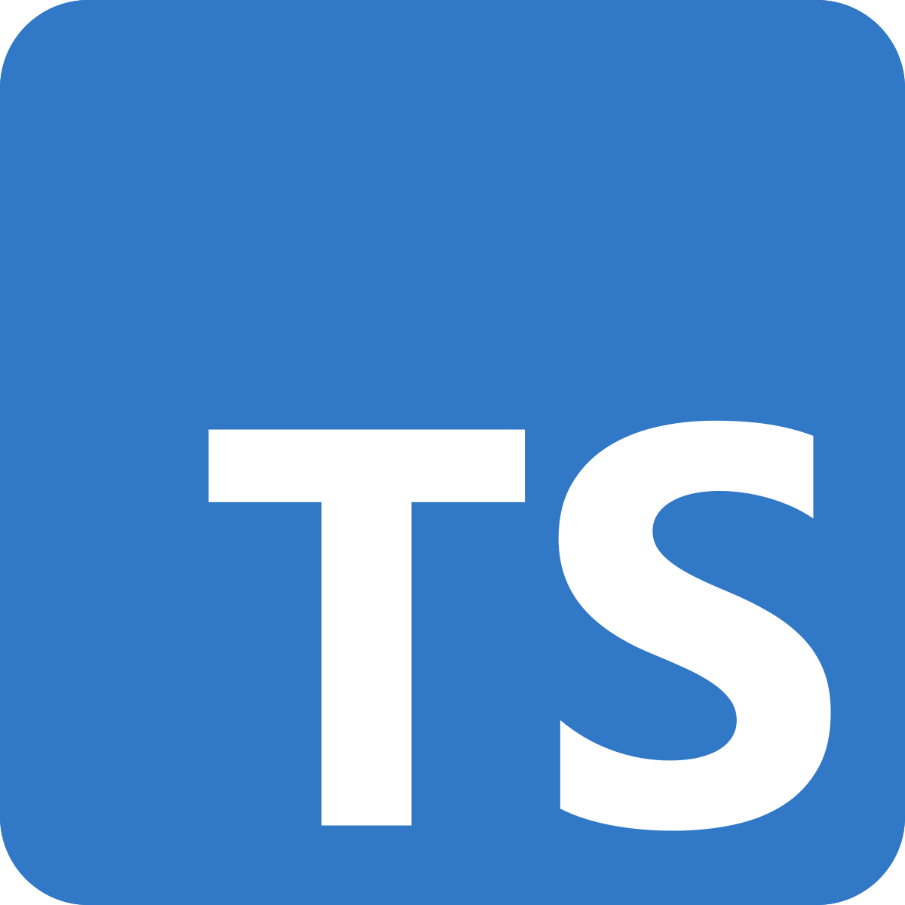

   

 

# About this Project

#### This project was created to introduce my personal portfolios and projects. Also, it aims to increase front-end skills by using TypeScript Programming Language and React Framework together.

#### You can check the current progress of the project by accessing the site below.
### [archiveeng.site](https://archiveeng.site/)
   

# About Me

#### Name &nbsp; | &nbsp; Young-Woo Kim
#### Major &nbsp; | &nbsp; Hongik University Computer Engineering
#### Position &nbsp; | &nbsp; Frontend Engineer
   

# Technologies and Software Used

#### Programming Languages
 

 

#### Frontend Server
 

 

#### Deployment
 

 

#### Domain Name Service
 

 

#### Version Control
 

&nbsp;&nbsp;&nbsp;&nbsp;&nbsp;&nbsp;&nbsp;&nbsp;&nbsp;&nbsp;

   